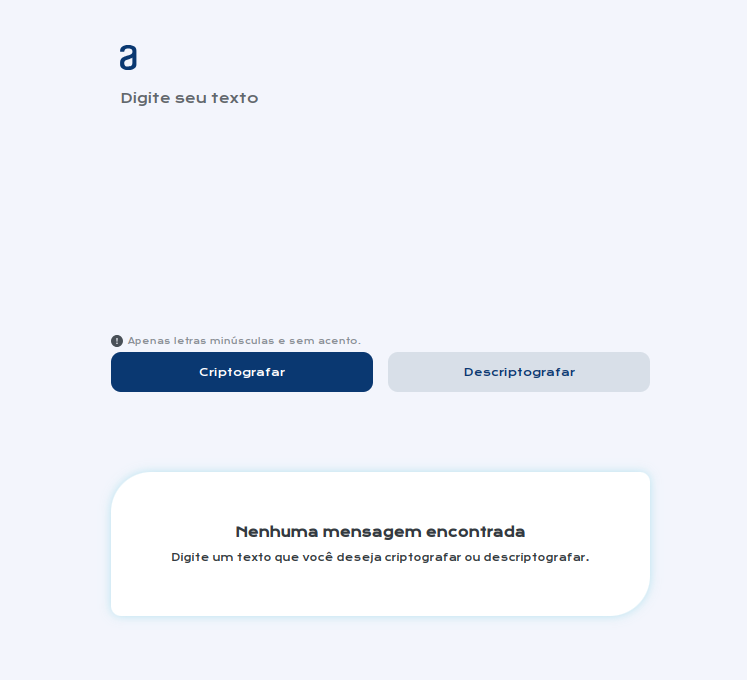
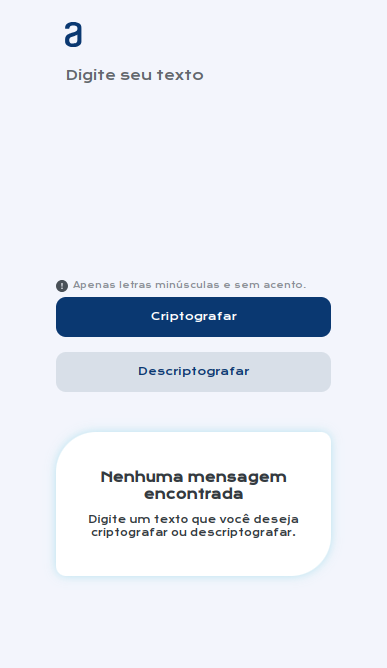

  

# Projeto Decodificador - Programa One Next Education

Challenge Decodificador, projeto desenvolvido no programa de formação OneNextEducation da Oracle em parceria com a Alura, com foco em aplicar os conhecimentos obtidos durante a formação Iniciante em Programação T6 - ONE.

## Responsividade do projeto

### Tela do Computador

  

### Tela do Tablet

  

### Tela do Celular

  

